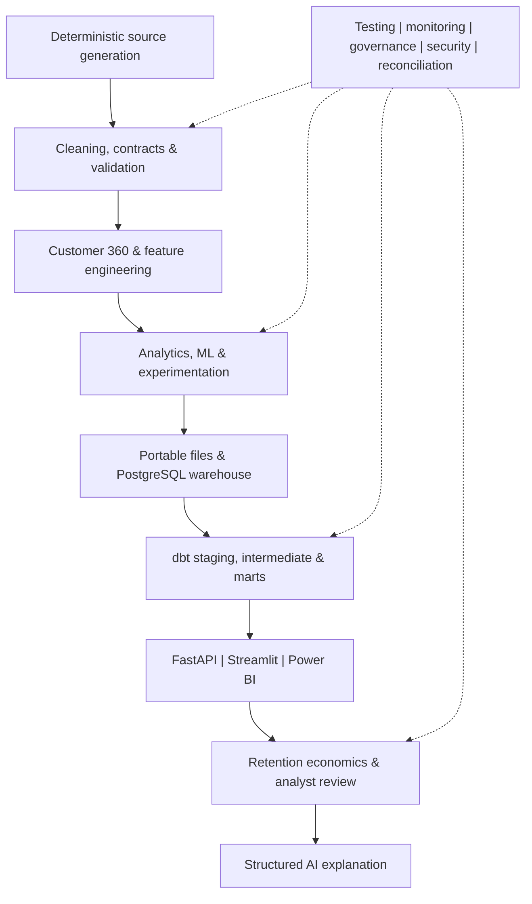
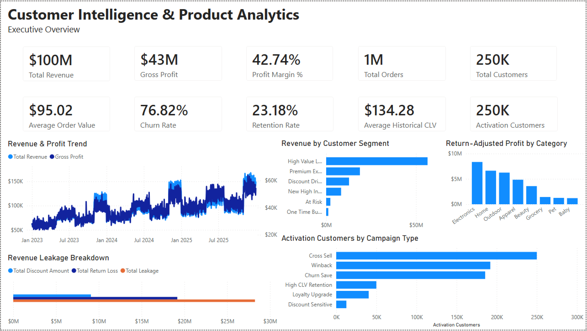
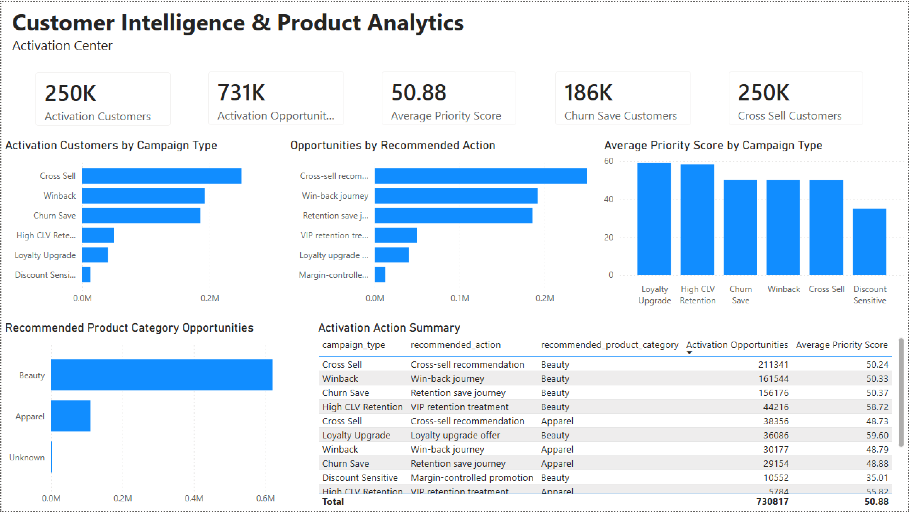
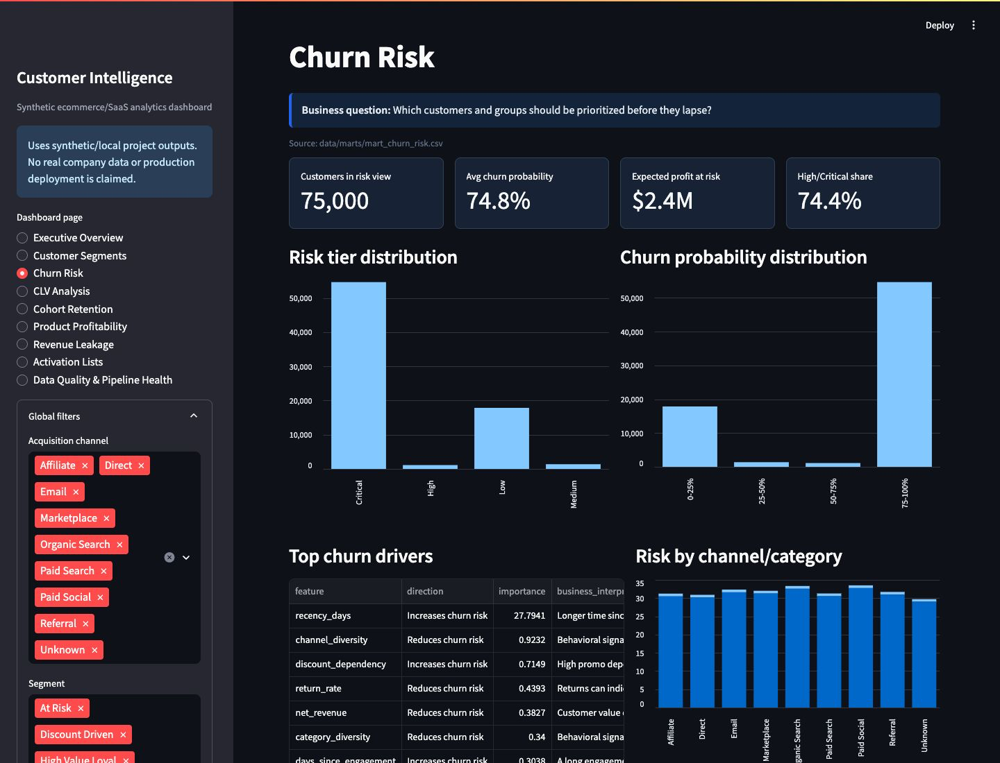

# Governed Customer Intelligence, Experimentation & Decision Support Platform

> From behavioral data to governed experiments, predictive models, BI, and review-ready retention decisions.

P3 unifies Customer 360, RFM and cohort analysis, churn and customer lifetime value (CLV) modeling, statistical experimentation, PostgreSQL/dbt, Power BI, FastAPI, Streamlit, and evidence-grounded decision support in one reproducible workflow.


[](https://github.com/darshil-mangukiya/customer-intelligence-product-analytics/actions/workflows/ci.yml)
[](LICENSE)

| 125/125 current Python tests | 12/12 Python ↔ R | 25/25 UAT | 18/18 AI evals | 0 known vulnerabilities |
|---:|---:|---:|---:|---:|

> **Data & scope:** Deterministic ecommerce/SaaS data supports reproducible execution without proprietary or customer records.

## Project at a Glance

| Area | What is implemented |
|---|---|
| Data | Reproducible customer, order, product, engagement, and experiment records |
| Analytics | Customer 360, RFM, segmentation, cohorts, churn, CLV, product profitability, retention, and formal statistics |
| Warehouse | PostgreSQL 16.15, dimensional models, dbt staging/intermediate/marts, tests, and reconciliation |
| Access | Read-only FastAPI, local Streamlit application, Power BI PBIX, and governed CSV contracts |
| Controls | Metric dictionary, lineage, model cards, artifact hashes, requirements traceability, and UAT |
| Runtime | Local Python and Docker execution |

**Navigate:** [Business problem](#business-problem) · [Architecture](#architecture) · [Analytics and experimentation](#customer-analytics--experimentation) · [Model governance](#model-validation--governance) · [Warehouse and interfaces](#warehouse-bi--application-access) · [Validation](#validation-scorecard) · [Quick start](#quick-start) · [Limitations](#limitations)

## Business Problem

Customer decisions rarely live in one clean table. Transaction value, engagement, returns, product margin, churn signals, cohort behavior, experiment outcomes, and intervention costs often disagree across teams or arrive without a shared definition.

P3 creates a traceable route from source records to analyst review. It helps answer:

- Which customers appear at risk, and which high-value customers merit review first?
- Which behavioral segments and acquisition cohorts retain differently?
- Where do returns, discounts, or product economics create value leakage?
- Is a retention experiment valid, statistically detectable, and practically meaningful?
- What would retention actions cost under explicit assumptions—and when is estimated ROI negative?
- Which governed source supports each metric, recommendation, and dashboard view?

The system supports analysis and prioritization only. It does not contact customers, approve experiments, or write to operational systems.

## What the Platform Delivers

- **Customer intelligence:** Customer 360 features, RFM profiles, five-cluster segmentation, lifecycle stages, segment migration, cohort retention, churn risk, CLV, and product/customer profitability.
- **Experimentation:** a registered retention experiment with power design, sample-ratio-mismatch (SRM) checks, lift, confidence intervals, two-proportion inference, practical-significance rules, and a decision log.
- **Predictive decision support:** held-out churn and CLV evaluation, capacity-aware top-K prioritization, exact linear-model explanations, calibration review, drift signals, and artifact identity.
- **Retention economics:** five explicit scenarios for target share, intervention cost, retained value, net benefit, and ROI; every action remains `NEEDS_REVIEW`.
- **Analytics engineering:** deterministic generation, validation gates, file contracts, PostgreSQL loading, dimensional modeling, dbt transformations, replay checks, and cross-layer reconciliation.
- **BI and applications:** Power BI, a local Streamlit exploration layer, 33 governed FastAPI GET routes, executive reports, and machine-readable exports.
- **Business analysis:** 18 requirements, 13 user stories, acceptance criteria, AS-IS/TO-BE process design, change-impact analysis, NFRs, source assessment, traceability, and 25 automated UAT cases.
- **Quality and security:** metric definitions, lineage, model cards, hash-locked dependencies, SBOM, dependency audit, secret scanning, and human-review controls.

## Architecture



### Why this architecture?

- Fixed seeds and data contracts make each analytical run reproducible.
- CSV outputs provide a portable review contract; PostgreSQL and dbt add schema, transformation, and serving-layer discipline. Eight reconciliations keep the two paths aligned.
- Statistics, model scores, CLV, revenue, lift, and ROI are calculated before they reach the AI layer.
- The churn model supports exact additive log-odds contributions. Forecast and calibration candidates are kept only when evaluation supports the change.
- The API exposes bounded, read-only analytical retrieval. Retention actions remain advisory.

### Stack by purpose

| Purpose | Technologies and practices |
|---|---|
| Analytics | Python, pandas, NumPy, SciPy, statsmodels, scikit-learn, base R |
| Warehouse / transformation | PostgreSQL, SQL, dbt Core + dbt-postgres, dimensional modeling, star schema with fact and dimension tables |
| BI / application | Power BI, DAX and Power Query specifications, FastAPI, Pydantic, Streamlit |
| Engineering | Docker, Docker Compose, Make, GitHub Actions configuration, pytest, Ruff |
| Reproducibility / security | Hashed lockfile, Git LFS, CycloneDX SBOM, pip-audit, sanitized secret scan, SHA-256 artifact reconciliation |
| AI | OpenAI-compatible Responses API provider, deterministic fake provider, disabled/fallback mode, structured aggregate packet |

## Customer Analytics & Experimentation

The customer layer connects behavioral, value, lifecycle, and product signals. Customer 360 and RFM features feed descriptive segments, cohort retention, churn and CLV models, product profitability, returns analysis, revenue leakage, and historical-to-current segment migration. Driver outputs describe associations, not causal effects.

### Statistical analysis and customer drivers

The reusable statistical layer implements descriptive statistics, t-based and Wilson confidence intervals, Welch mean tests, two-proportion z-tests, Pearson chi-square tests, Pearson and Spearman associations, and method-specific effect sizes. Seven planned analytical questions use Holm family-wise error correction; the experiment design also reports power and minimum detectable effect (MDE).

Customer-driver outputs combine standardized multivariable logistic coefficients and Welch group comparisons for churn with Spearman rank associations for historical CLV. A separate explanatory OLS model uses standardized predictors and HC3 robust standard errors for modeled CLV. These analyses identify relationships worth investigating and do not establish causality.

### Experiment evaluation

The registered experiment fixes the population, baseline, desired minimum detectable effect, alpha, power, primary metric, guardrails, and practical threshold before readout. SRM is checked before treatment effects are interpreted.

| Metric | Result |
|---|---:|
| Control | 1,809 customers; 5.91% conversion |
| Treatment | 1,702 customers; 8.70% conversion |
| Absolute / relative lift | +2.78 percentage points / +47.01% |
| 95% confidence interval | +1.06 to +4.51 percentage points |
| Two-sided p-value | 0.001509 |
| Approximate achieved 80%-power MDE | 2.23 percentage points |
| SRM | PASS (p = 0.0710) |

The observed difference is statistically detectable and exceeds the predefined two-percentage-point practical threshold. The [experiment readout](reports/experiments/synthetic_retention_offer_v1_readout.md) records the decision and guardrails; the [statistical methodology](docs/statistical_analysis_methodology.md) documents assumptions and calculations.

### Independent Python ↔ R validation

Base R independently recalculates group counts, rates, lift, confidence bounds, test statistic, p-value, and significance conclusions from the experiment assignments. Python reconciles the two implementations at a defined numeric tolerance. Independent calculation reduces the chance that a single implementation error passes unnoticed.

## Model Validation & Governance

### Churn prioritization

The standardized logistic-regression model is evaluated on an untouched holdout using ROC-AUC, PR-AUC, precision, recall, F1, log loss, Brier score, confusion metrics, ranking lift, and intervention capacity.

| Held-out metric | Result |
|---|---:|
| ROC-AUC / PR-AUC | 0.9958 / 0.9986 |
| Precision / recall / F1 | 0.9966 / 0.9525 / 0.9741 |
| Brier score | 0.0270 |
| Holdout rows | 1,250 |

These unusually high values reflect the separability of the project dataset and should not be used as expectations for another dataset.

Multiple fixed thresholds were tested, but none selected a non-empty population within five percentage points of the 20% intervention capacity assumption. The operating recommendation is explicit **top-K ranking**, not a universal cutoff. Sigmoid and isotonic calibration improved Brier score by about 0.0032 and 0.0039 respectively, but neither exceeded the predefined 0.005 material-improvement rule, so raw probabilities were retained.

Explainability uses the logistic model's exact additive contribution decomposition in log-odds space, with a maximum local probability-reconciliation error of `1.919e-22`. This is not SHAP. The contributions explain model behavior, not causality.

### CLV validation

The CLV workflow builds customer features through a temporal cutoff and uses profit from the following 90 days as the target for a histogram gradient-boosting regressor. A fixed 75/25 holdout recorded MAE of **19.03** and R² of **0.2092** on 1,250 test rows. The resulting 12-month value estimate supports CLV bands, channel and cohort analysis, value-at-risk reporting, and retention prioritization; its artifact, feature/dataset versions, and SHA-256 identity are registered alongside churn and segmentation.

### Segmentation and forecasting

The operational segmentation uses **k = 5** (silhouette 0.289; Davies–Bouldin 1.121). Validation covers k=3–7, cluster balance, time slices, and multiple seeds; mean adjusted Rand index across seeds was 0.9986. K=5 was retained for stable, interpretable customer-strategy coverage rather than as a universal optimum.

Revenue forecasting uses expanding-window walk-forward validation and compares multiple candidates across MAE, RMSE, MAPE, sMAPE, bias, and interval coverage. The seasonal-naive baseline achieved the lowest MAE (8,997.64) and remains the selected benchmark.

### Drift and monitoring

Recorded local baseline comparisons monitor feature distributions, missingness, churn and CLV scores, risk-tier mix, and segment shares. Population stability index (PSI), Kolmogorov–Smirnov statistics, and explicit review thresholds distinguish `STABLE`, `WATCH`, and `MATERIAL_DRIFT` states. The current sample comparison flags customer tenure as material drift and the churn-probability distribution as `WATCH`, while all five segment-share signals remain stable; these are review triggers, not evidence of performance degradation or continuous production monitoring.

Three model artifacts—churn, CLV, and segmentation—are recorded with validation state, dataset/feature versions, and SHA-256 identity. Recovery tests regenerated churn probabilities, segmentation assignments, and CLV predictions exactly. See the [model registry guide](docs/model_registry.md) and [model cards](docs/model_cards/churn_model_card.md).

## Retention Decision Support

Five scenarios vary target share, assumed retention lift, and contact cost, then estimate retained customers, preserved revenue/CLV, intervention expense, net benefit, and ROI. Under the “Expected” assumptions, estimated net benefit is **-$11,801** and ROI is **-0.75**. The negative result is retained because the assumed intervention is not economically attractive.

The Retention Action Center combines churn tier, customer value, segment movement, driver analysis, experiment validity, and scenario economics into review priorities. Every row remains `NEEDS_REVIEW`; no external message is sent and no system of record is modified.

## Warehouse, BI & Application Access

### PostgreSQL and dbt

The locally executed PostgreSQL 16.15 warehouse contains **9 schemas, 37 relations, 19 loader targets, 6 primary keys, and 6 foreign keys**. Its dimensional **star schema** uses customer, product, and date **dimension tables** with order, session, customer-value, and cohort-retention **fact tables**. PK/FK constraints and reconciliation cover customer, transaction, revenue, product, segment, churn, CLV, and experiment populations.

dbt separates declared sources and cleanup contracts into staging, reusable logic into intermediate models, and business/quality outputs into marts. The project also includes schema and singular tests, a customer-value snapshot, governed metrics, macros, and one Power BI exposure. The build contains 57 executable nodes. Python handles source generation and ML scoring; dbt handles warehouse transformation.

Data quality is treated as a publication control: source and output contracts define grain, required columns, keys, row minimums, and freshness expectations. Automated checks cover nulls, duplicates, accepted values, numeric ranges, referential integrity, business rules, analytical-result schemas, row counts, and revenue reconciliation. Sample and full-volume gates remain distinct so a bounded local run cannot silently satisfy production-scale minimums.

Lineage runs from `data/raw` → `data/processed` → features/marts → PostgreSQL/dbt → models and interfaces → decision outputs. Details are in the [customer-intelligence lineage](governance/customer_intelligence_lineage.md) and [source-to-target mapping](docs/source_to_target_mapping.md).

### FastAPI, Streamlit, Power BI, and Tableau

- **FastAPI:** 33 read-only GET routes with Pydantic responses, bounded parameters, optional `X-API-Key`, local CORS, no arbitrary SQL, and no write endpoints.
- **Streamlit:** a local exploration layer for executive KPIs, Customer 360, churn, CLV, segments, cohorts, profitability, leakage, customer drivers and experiments, data quality, and activation review.
- **Power BI:** a Git LFS-tracked PBIX with customer, churn/retention, CLV, cohort, segment, product, and activation views plus DAX, semantic-model, build, and QA specifications.
- **Tableau:** the local Desktop 2026.1 workbook contains nine governed presentation sources, 36 worksheets, seven dashboards, and a seven-point Story. **All 7/7 dashboards and 7/7 Story points manually rendered, the packaged TWBX passed close/reopen validation, the portable standalone TWB passed reopen validation, and 8/8 genuine Tableau screenshots are present.** The four parameters and five generated actions were not separately certified, two Go-to-Sheet actions remain optional, and no external publication is claimed.



*Executive view connecting customer value, retention, revenue, profitability, leakage, and activation demand.*



*Decision-support view translating analytical outputs into reviewable campaign opportunities and priority scores.*



*Interactive churn review combining risk distribution, value exposure, associated signals, and governed filters.*

## 5-Minute Review

1. [Tableau implementation-kit status and reviewer route](dashboards/tableau/README.md)
2. [Seven-dashboard and Customer Retention Decision Story contract](dashboards/tableau/workbook/WORKBOOK_SPEC.md)
3. [Tableau calculated fields, LODs, and table calculations](dashboards/tableau/calculations/CALCULATED_FIELDS.md)
4. [Eight genuine Tableau screenshots](dashboards/tableau/screenshots/README.md)
5. [Tableau expected-results reconciliation](dashboards/tableau/validation/tableau_validation_report.md)
6. [Power BI executive and activation evidence](dashboards/powerbi/screenshots/)
7. [Synthetic experiment readout](reports/experiments/synthetic_retention_offer_v1_readout.md)
8. [Architecture and governed analytical lineage](docs/architecture_overview.md)

The Tableau workbook’s seven dashboards and seven Story points were manually rendered in Desktop 2026.1. Eight genuine exports provide visual evidence, the packaged workbook passed close/reopen validation, and the standalone TWB passed reopen validation after its path-only portability edit. Both final workbook artifacts are portable.

## Business Analysis & AI

### Business-analysis package

The package contains **18 requirements, 13 testable user stories, acceptance criteria, an AS-IS/TO-BE customer-decision process, change-impact assessment, non-functional requirements, source assessment, an Excel traceability matrix, and 25 UAT cases**. These artifacts model the stakeholder workflow for Product, retention, Finance, customer strategy, analytics, and BI roles.

### Customer strategy copilot

The copilot receives a versioned aggregate insight packet and returns a structured response. Evaluations cover numeric fidelity, statistical provenance, privacy, prompt injection, causality, contradictory, stale or missing inputs, disabled mode, and fallback behavior.

Deterministic code calculates CLV, revenue, ROI, experiment statistics, lift, and model scores before the packet reaches the model. The copilot explains those values with source references and warnings. It cannot run arbitrary SQL, execute shell commands, write to a CRM, contact customers, or approve decisions. An OpenAI-compatible Responses API provider, deterministic fake provider, and disabled/fallback mode share the same response contract.

## Security, Performance & Recovery

Reproducible installation uses a fully pinned `requirements.lock` with hash enforcement. The repository also includes a CycloneDX 1.6 SBOM with 99 components, a 98-row license inventory, and a locked dependency audit with **zero known vulnerabilities**. The container runs as a non-root user, and Compose services use `no-new-privileges` where applicable. A sanitized repository scan checks for embedded secrets.

GitHub Actions recreates the Python 3.12 environment from the hashed lockfile, regenerates analytical outputs, runs Python/R reconciliation, exercises PostgreSQL and dbt, executes AI evaluations and UAT, and validates the Docker build. The recorded Compose run completed the bounded pipeline with healthy PostgreSQL, FastAPI, and Streamlit services.

### Local controlled benchmarks

| Workload | Volume | Result | Memory / latency |
|---|---:|---:|---:|
| Pandas pipeline | 5K customers | 26.78 s | 427 MB peak RSS |
| Pandas pipeline | 50K customers | 130.69 s | 1.46 GB peak RSS |
| FastAPI | 400 requests, 1–50 clients | 100% success; 124–275 req/s | p95 50–174 ms |

The 50K run shows meaningful single-node memory growth. A 250K profile was not forced during the bounded benchmark.

A PostgreSQL custom-format backup was restored, disrupted in a disposable target, restored again, and reconciled to the exact 25,037-row transaction count and revenue total. The measured 4.2 MB restore took 0.335 seconds locally. Two 19-table loader replays preserved counts and totals, and model recovery reproduced registered behavior. Design targets are a 24-hour RPO and 30-minute RTO.

## Validation Scorecard

| Validation | Recorded result |
|---|---:|
| Python test suite | 125/125 PASS, including 27/27 Tableau presentation-layer tests |
| Python ↔ base-R reconciliation | 12/12 PASS |
| Automated UAT | 25/25 PASS |
| Deterministic AI evaluations | 18/18 PASS |
| PostgreSQL loader / reconciliations | 19/19 / 8/8 PASS |
| dbt models / standalone tests | 15/15 / 41/41 PASS |
| Model artifact recovery | 3/3 PASS |
| Locked dependency audit | 0 known vulnerabilities |
| Analytical/data validation | 64/69 PASS in sample mode |

The five sample-mode analytical failures are full-volume minimum gates and are expected with the default bounded 5K-customer dataset. CI configuration is linked by the badge above; remote status comes from the workflow itself.

## Engineering & Analytical Tradeoffs

- pandas keeps local execution simple, but the 50K benchmark shows where memory becomes a constraint.
- CSV contracts make outputs easy to inspect. PostgreSQL and dbt add schema and transformation controls, with reconciliation needed to keep both paths aligned.
- Standardized logistic regression supports exact contribution accounting. Additional model complexity requires a measurable decision benefit.
- Retention capacity is represented through top-K ranking because tested fixed thresholds did not select the intended operating volume.
- Calibration candidates were rejected when Brier-score improvements fell below the predefined materiality threshold.
- Seasonal naive remains the revenue-forecast benchmark because it produced the lowest walk-forward MAE.
- Deterministic code owns calculated metrics. The language model receives a bounded packet and produces explanations.

## Repository Tour

| Path | Purpose |
|---|---|
| `etl/`, `feature_engineering/` | Source generation, cleaning, Customer 360, and feature contracts |
| `analytics/`, `experimentation/` | Statistical questions, experiment design/readout, Python ↔ R reconciliation |
| `models/`, `model_validation/`, `model_registry/` | Trusted artifacts, evaluation, calibration, drift, recovery, and registry logic |
| `segmentation/`, `cohort_analysis/`, `retention_analytics/`, `product_analytics/` | Customer and product analytical domains |
| `warehouse_loader/`, `sql/`, `dbt/` | PostgreSQL loading, dimensional SQL, transformations, and tests |
| `api/`, `app/`, `dashboards/` | FastAPI, Streamlit, Power BI, and Tableau implementation-kit access layers |
| `business_analysis/`, `governance/` | Requirements, UAT, process design, metrics, and lineage |
| `ai/` | Governed insight packet, providers, structured copilot, and evaluations |
| `validation/`, `monitoring/`, `observability/` | Quality gates, drift/freshness signals, contracts, and runbooks |
| `security/`, `tests/`, `reports/`, `docs/` | Supply-chain records, automated checks, execution reports, and documentation |

## Quick Start

Python 3.12 is required.

```bash
git clone https://github.com/darshil-mangukiya/customer-intelligence-product-analytics.git
cd customer-intelligence-product-analytics
python3.12 -m venv .venv
source .venv/bin/activate
python -m pip install --require-hashes -r requirements.lock
cp .env.example .env
make sample PYTHON=.venv/bin/python
```

Run the core checks and local interfaces:

```bash
.venv/bin/python -m pytest
.venv/bin/python -m ruff check . --no-cache
make api PYTHON=.venv/bin/python       # http://127.0.0.1:8000/docs
make app PYTHON=.venv/bin/python       # http://127.0.0.1:8501
```

Base R is optional for the main pipeline. With R available, run `make analytics PYTHON=.venv/bin/python` followed by `make r-validate PYTHON=.venv/bin/python` for independent experiment reconciliation.

Optional Docker path:

```bash
docker compose up --build
```

Compose provides PostgreSQL on `5432`, FastAPI on `8000`, Streamlit on `8501`, and the bounded analytics-pipeline service. The default database credential is for disposable local development only. Advanced PostgreSQL/dbt execution is documented in the [loader guide](docs/postgres_loader_guide.md) and [dbt runbook](docs/dbt_production_runbook.md).

## Selected Documentation

- [Architecture overview](docs/architecture_overview.md) and [analytical lineage](governance/customer_intelligence_lineage.md)
- [Statistical methodology](docs/statistical_analysis_methodology.md) and [experiment readout](reports/experiments/synthetic_retention_offer_v1_readout.md)
- [Churn model card](docs/model_cards/churn_model_card.md), [calibration decision](reports/churn_probability_calibration.md), and [segmentation validation](reports/segmentation_validation.md)
- [PostgreSQL execution report](reports/postgresql_execution_report.md) and [dbt modeling guide](docs/dbt_modeling_guide.md)
- [FastAPI reference](docs/api/api_reference.md) and [runtime validation](reports/api_runtime_validation.md)
- [Business requirements](business_analysis/business_requirements.md) and [customer decision process](business_analysis/customer_decision_process.md)
- [Customer metrics dictionary](governance/customer_metrics_dictionary.md) and [data contracts](docs/data_contracts.md)
- [AI data policy](governance/ai_data_policy.md)
- [Dependency audit](security/reports/dependency_audit.md) and [advisory triage](security/reports/starlette_advisory_triage.md)
- [Performance benchmark](reports/performance_benchmark.md) and [recovery drill](reports/postgresql_recovery_drill.md)
- [Power BI implementation guide](dashboards/specs/powerbi_implementation_guide.md)
- [Tableau implementation](dashboards/tableau/README.md), [Desktop validation guide](dashboards/tableau/MANUAL_TABLEAU_BUILD_AND_VALIDATION.md), and [retention review case study](docs/case_studies/retention_review_case_study.md)

## What Would Change in Production?

A deployed version would use source contracts and consent-aware customer data; managed secrets and IAM; stronger authentication, TLS, rate limits, and a reverse proxy; centralized logs, metrics, and traces; off-site backup retention; stakeholder-led UAT; privacy and compliance review; ongoing subgroup and model monitoring; controlled CI/CD; and Power BI Service configuration where required.

## Limitations

- This is a local/Docker implementation, not a production or cloud deployment. Performance figures are controlled local benchmarks, and the 50K pandas run shows significant memory growth.
- Retention economics are scenario estimates. Requirements and UAT represent the designed workflow rather than organizational sign-off or adoption.
- Live OpenAI execution is not part of the recorded validation state. Power BI Service, gateways, scheduled refresh, and production RLS are also outside the demonstrated scope.
- Tableau dashboard, Story, screenshot, TWBX reopen, and portable standalone-TWB reopen validation are demonstrated locally. Separate parameter/action certification, Hyper extracts, and Tableau Server/Cloud/Public deployment remain outside the recorded state.
- Local security, drift, and subgroup checks are engineering controls, not penetration testing, compliance certification, fairness certification, or contractual SLA evidence.

## License

Licensed under the [MIT License](LICENSE).
