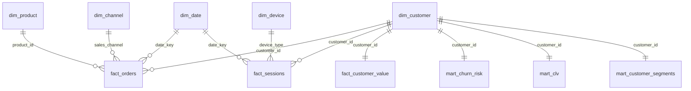

# Power BI Relationship Diagram

## Relationship Rules

- Use single-direction filters from dimensions to facts.
- Keep `mart_*` tables at their declared grain and avoid many-to-many relationships unless using bridge tables.
- Hide raw technical columns from report view.
- Use the DAX catalog for KPI cards instead of visual-level calculations.

