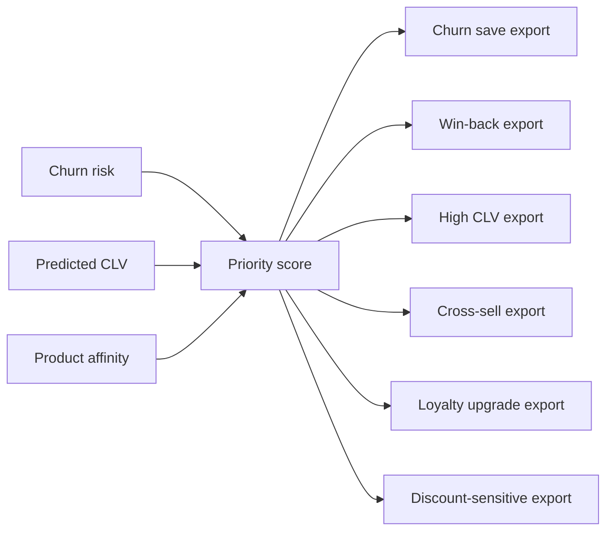

# Activation Flow

```mermaid
flowchart LR
  A[Churn risk] --> D[Priority score]
  B[Predicted CLV] --> D
  C[Product affinity] --> D
  D --> E[Churn save export]
  D --> F[Win-back export]
  D --> G[High CLV export]
  D --> H[Cross-sell export]
  D --> I[Loyalty upgrade export]
  D --> J[Discount-sensitive export]
```

Reverse-ETL style customer lists are generated for lifecycle use cases.
