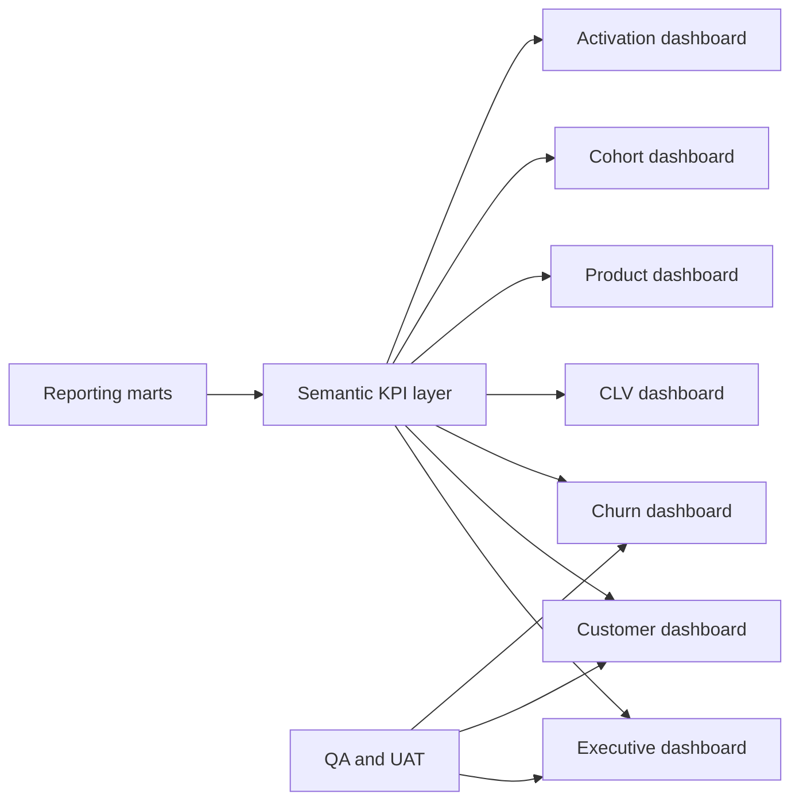

# Dashboard Layer

```mermaid
flowchart LR
  A[Reporting marts] --> B[Semantic KPI layer]
  B --> C[Executive dashboard]
  B --> D[Customer dashboard]
  B --> E[Churn dashboard]
  B --> F[CLV dashboard]
  B --> G[Product dashboard]
  B --> H[Cohort dashboard]
  B --> I[Activation dashboard]
  J[QA and UAT] --> C
  J --> D
  J --> E
```

Dashboards consume governed marts and semantic KPIs.
