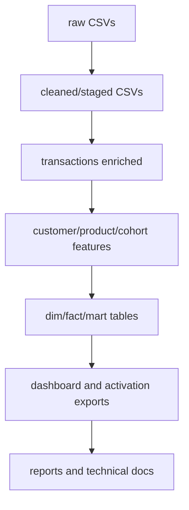

# Data Flow

```mermaid
flowchart TB
  raw[raw CSVs] --> clean[cleaned/staged CSVs]
  clean --> enriched[transactions enriched]
  enriched --> features[customer/product/cohort features]
  features --> marts[dim/fact/mart tables]
  marts --> exports[dashboard and activation exports]
  exports --> docs[reports and technical docs]
```

Raw source-like data is transformed into governed marts and outputs.
