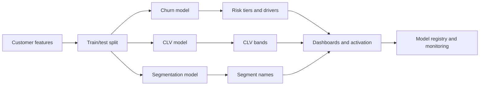

# ML Pipeline

```mermaid
flowchart LR
  A[Customer features] --> B[Train/test split]
  B --> C[Churn model]
  B --> D[CLV model]
  B --> E[Segmentation model]
  C --> F[Risk tiers and drivers]
  D --> G[CLV bands]
  E --> H[Segment names]
  F --> I[Dashboards and activation]
  G --> I
  H --> I
  I --> J[Model registry and monitoring]
```

Churn, CLV, and segmentation outputs feed BI and activation.
