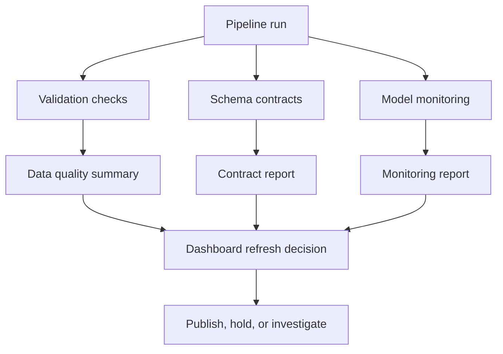

# Observability Flow

```mermaid
flowchart TB
  A[Pipeline run] --> B[Validation checks]
  A --> C[Schema contracts]
  A --> D[Model monitoring]
  B --> E[Data quality summary]
  C --> F[Contract report]
  D --> G[Monitoring report]
  E --> H[Dashboard refresh decision]
  F --> H
  G --> H
  H --> I[Publish, hold, or investigate]
```

Observability outputs support dashboard readiness and incident review.
