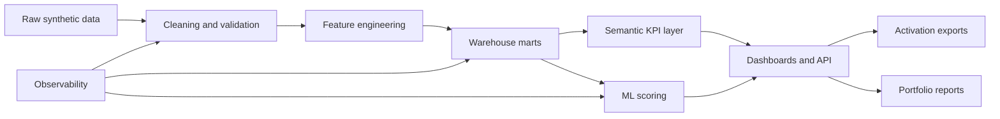

# System Architecture

```mermaid
flowchart LR
  A[Raw synthetic data] --> B[Cleaning and validation]
  B --> C[Feature engineering]
  C --> D[Warehouse marts]
  D --> E[Semantic KPI layer]
  D --> F[ML scoring]
  E --> G[Dashboards and API]
  F --> G
  G --> H[Activation exports]
  G --> I[Portfolio reports]
  J[Observability] --> B
  J --> D
  J --> F
```

End-to-end view of the local production simulation.
