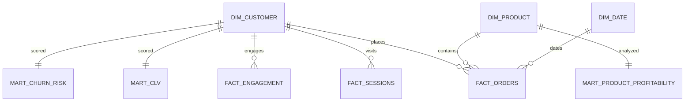

# Warehouse Model

```mermaid
erDiagram
  DIM_CUSTOMER ||--o{ FACT_ORDERS : places
  DIM_PRODUCT ||--o{ FACT_ORDERS : contains
  DIM_DATE ||--o{ FACT_ORDERS : dates
  DIM_CUSTOMER ||--o{ FACT_SESSIONS : visits
  DIM_CUSTOMER ||--o{ FACT_ENGAGEMENT : engages
  DIM_CUSTOMER ||--|| MART_CLV : scored
  DIM_CUSTOMER ||--|| MART_CHURN_RISK : scored
  DIM_PRODUCT ||--|| MART_PRODUCT_PROFITABILITY : analyzed
```

Warehouse relationships for BI-ready dimensional reporting.
